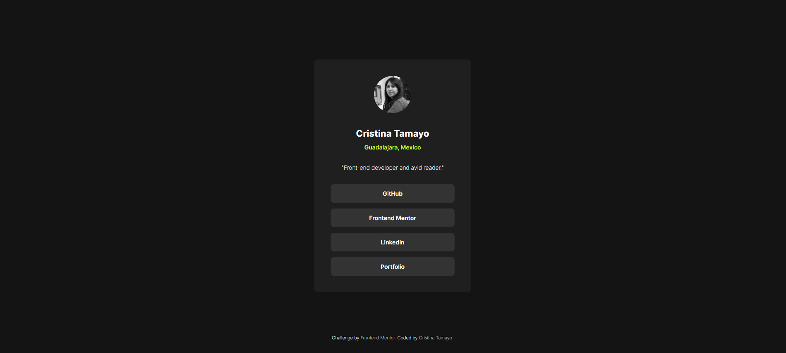

# Frontend Mentor - Social links profile solution

This is a solution to the [Social links profile challenge on Frontend Mentor](https://www.frontendmentor.io/challenges/social-links-profile-UG32l9m6dQ). Frontend Mentor challenges help you improve your coding skills by building realistic projects.

## Table of contents

- [Overview](#overview)
  - [The challenge](#the-challenge)
  - [Screenshot](#screenshot)
  - [Links](#links)
- [My process](#my-process)
  - [Built with](#built-with)
  - [What I learned](#what-i-learned)
  - [Continued development](#continued-development)
- [Author](#author)

## Overview

### The challenge

Users should be able to:

- See hover and focus states for all interactive elements on the page

### Screenshot




### Links

- Solution URL: [My challenge solution](https://github.com/CristinaTamayo/FM-challenge-social-links-profile)
- Live Site URL: [Live site](https://cristinatamayo.github.io/FM-challenge-social-links-profile)

## My process

### Built with

- Semantic HTML5 markup
- CSS custom properties
- Flexbox

### What I learned

Learned a new way to center a container in the midle of the page by setting the position to absolute and move it from the top an left, then in order to keep center translate the same amount in negative. Applied similar formula with the footer to keep below and center.

For reference see below:

```css
.card-container {
    min-width: 300px;
    position: absolute;
    top: 50%;
    left: 50%;
    transform: translate(-50%, -50%);

footer {
    position: absolute;
    bottom: 4%;
    left: 50%;
    transform: translate(-50%, 0%);
}
```

### Continued development

Next time I would like to focus more on the first-mobile coding when writting the css.

## Author

- Website - [My Portfolio](https://cristinatamayo.github.io/portfolio/)
- Frontend Mentor - [@CristinaTamayo](https://www.frontendmentor.io/profile/CristinaTamayo)
- Linkedin - [@CristinaTamayo](https://www.linkedin.com/in/cristina-tamayo-a45000116/)
